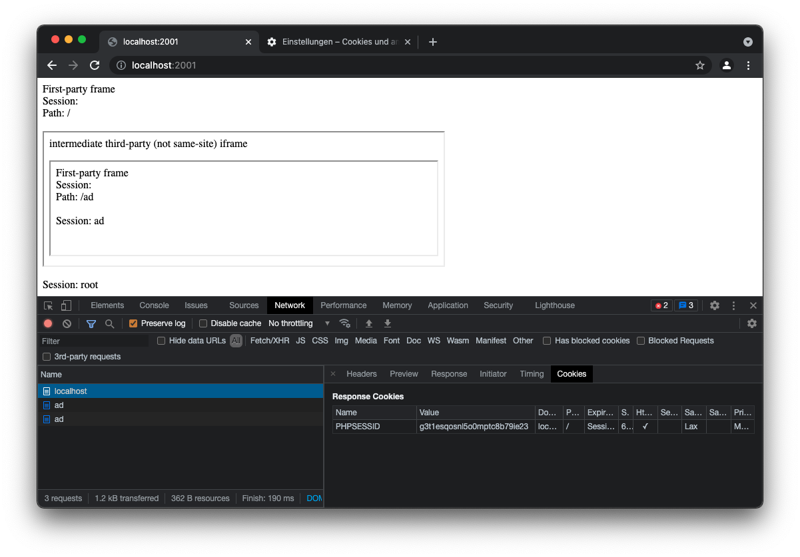
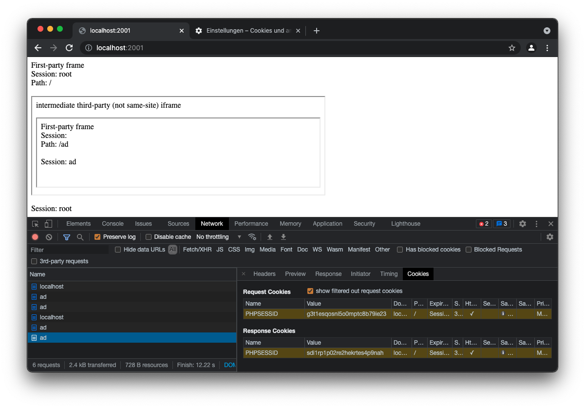
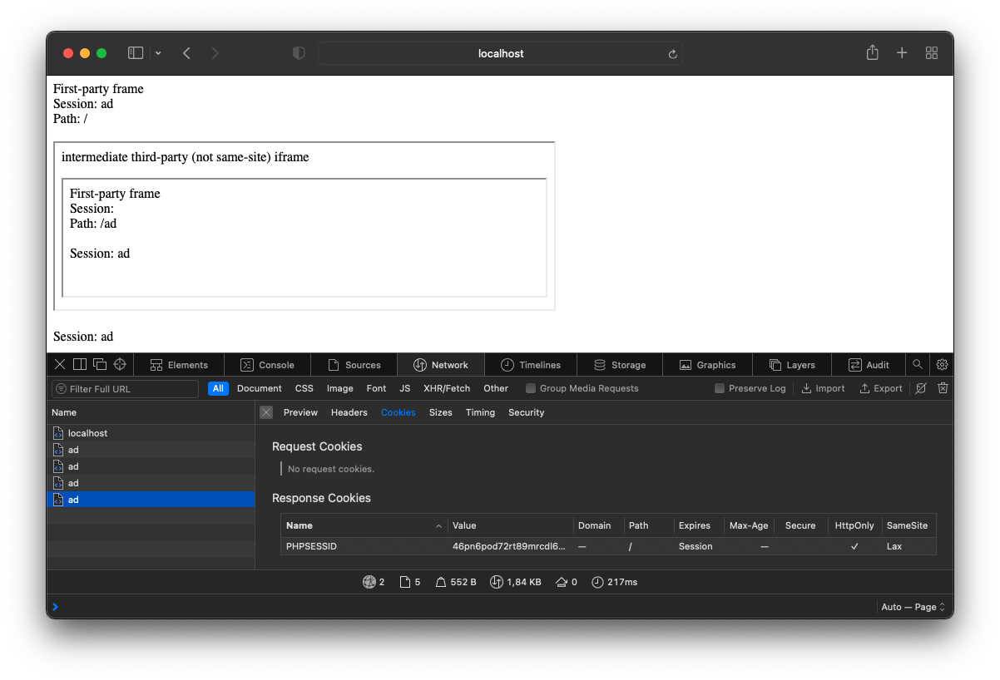

# Safari PoC: `SetCookie` via intermediate 3rd-party iframe

## How to use

Create a host entry in `/etc/hosts`:

```
127.0.0.1   ad
```

Start servers:

```shell
php -S localhost:2001 root.php
php -S localhost:2002 ad.php
```

Open [localhost:2001](http://localhost:2001).

Refresh the page once.

Firefox and Chrome will display a different output than Safari,
because Firefox and Chrome do not allow setting a `SameSite=Lax`-cookie
via an intermediate 3rd-party iframe.

## Chrome blocks cookies from same-site when loaded via 3rd-party frame

> Also true for Firefox.




## Safari allows cookies from same-site when loaded via 3rd-party frame


